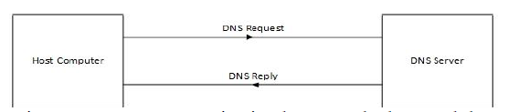

# SMTP Enmuration

### Setting up lab environment

With root privilege add a entry as shown in /etc/hosts file.

```text
127.0.1.2    mail.prajjwal.lab
```


Installing Postfix

```text
$ sudo apt-get install postfix
```


After this a postfix configuration dialog box is shown prompting to choose the type of mail server needed.




Open **/etc/postfix/main.cf** file and make the following changes

```text
mynetworks = 127.0.0.0/8 192.168.43.1/24
inet_protocols = ipv4
home_mailbox = Maildir/
```


Restart postfix and view the open ports, note that port 25 is opn and its STATE is LISTEN.

```text
$ sudo service postfix restart
$ netstat -tnl
```


Install  & Configure Dovecot

```text
$ sudo apt-get install dovecot-imapd dovecot-pop3d
```

```text
$ sudo gedit /etc/dovecot/conf.d/10-auth.conf

Uncomment the following lines
#disable_plaintext_auth = yes

Change auth_mechanish from plain to plain login
auth_mechanism = plain login

$ sudo gedit /etc/dovecot/conf.d/10-mail.conf

change the mail location as
mail_location = maildir:/home/%u/Maildir

$ sudo gedit /etc/dovecot/conf.d/10-master.conf

Uncomment inet_listner imap port
port = 143

Uncomment inet_listner pop3 port
port = 110

Give permission to unix_listner auth-userdb
unix_listner auth-userdb {
    mode = 0600
    user = postfix
    group = postfix
}
```

changes in 10-auth.conf


changes in 10-mail.conf


changes in 10-master.conf


restart dovecot and check for open ports

```text
$ sudo service dovecot restart
$ netstat -tnl
```


Setting Mail accounts in Thunderbird manual settings


